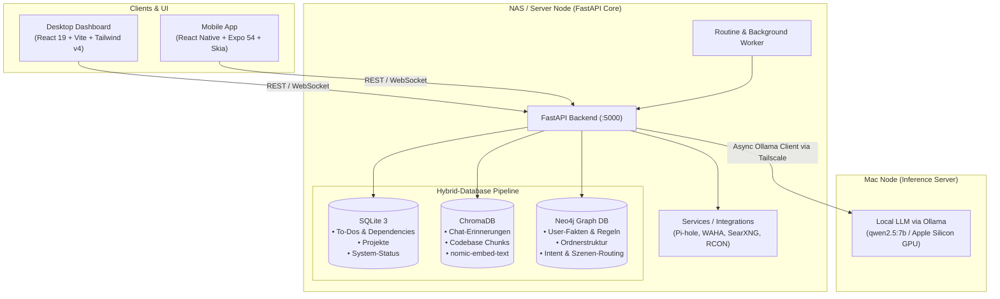

# EVE — AI-Assisted Homelab & Personal OS

> **EVE** ist ein verteiltes, KI-gestütztes Home-OS und persönliches Betriebssystem mit einer fortschrittlichen **Hybrid-Database & RAG-Pipeline**. Es verbindet ein zentrales NAS-Backend, lokale LLM-Inferenz auf dedizierter Hardware (Apple Silicon Mac), relationale Daten, Vektorspeicher und Wissensgraphen mit modernen Desktop- und Mobile-Frontends.

---

## 🌟 Übersicht & Hauptfunktionen (Features)

EVE dient als intelligenter, allwissender Assistent und Kontrollzentrum für das gesamte Homelab und den Alltag. Die Plattform gliedert sich in folgende Kernmodule:

* 🧠 **EVE Core & AI-Chat (Hybrid-RAG):**
  * Kontextsensitive Assistenz mit situativem Intent- und Szenen-Routing über Neo4j.
  * Live-Dateizugriff und Codebase-Analyse in Echtzeit ohne Halluzinationen.
  * Episodisches Kurz- und Langzeitgedächtnis über Vektoreinbettungen.
* 📋 **To-Dos & Projekte mit Graph-View:**
  * Relationales Aufgaben- und Projektmanagement via SQLite mit Abhängigkeiten (`depends_on_id`), Status-Tracking und Prioritäten.
  * Graphbasierte Visualisierung von Aufgaben-Hierarchien und Projekt-Zusammenhängen.
* 📅 **Kalender & Terminmanagement:**
  * Synchronisierte Kalenderverwaltung mit Kategorie-Filtern, Alarmen und direkter Verknüpfung in den KI-Kontext.
* 💻 **Web-Terminal & VSCode Server:**
  * Integriertes interaktives Terminal direkt im Dashboard über `xterm.js` zur schnellen Serververwaltung.
  * Nahtlose Integration in lokale und remote IDE-Instanzen.
* 🛡️ **Pi-hole DNS- & Netzwerkschutz:**
  * Überwachung von DNS-Queries, Blockstatistiken und Whitelist/Blacklist-Management mit Neo4j-Domain-Sync.
* 🎮 **Minecraft-RCON & Hypixel Worker:**
  * Live-RCON-Serversteuerung, Statusabfragen und automatisierte Hypixel-Status-Synchronisation.
* 🎬 **Streaming-Mediathek & Video Studio:**
  * Zentrale Verwaltung von Medienverzeichnissen (`/nas/recherchen`, `/home/Filme`, `/home/Serien`), Vorschau-Generierung und Video-Material-Streaming.
* 💬 **WhatsApp Integration (WAHA Gateway):**
  * Automatisierte Kommunikation und Benachrichtigungen via WhatsApp HTTP API (WAHA).
* ⛅ **Wetter & Ambient Voice Mode:**
  * Live-Wetterabfrage (Open-Meteo) und interaktiver Ambient-Modus mit Audio-Sprachausgabe.
* 📱 **Mobile App (EVE Mobile):**
  * Vollwertiger mobiler Client für iOS und Android mit Hardware-beschleunigten Skia-Visualisierungen und Status-Monitor.

---

## 🏗️ System-Architektur & Hybrid-Database Pipeline

EVE setzt auf eine verteilte Topologie, die rechenintensive LLM-Inferenz, Datenspeicherung und Clients über ein sicheres **Tailscale Mesh-Netzwerk** (100.x.x.x) koppelt:



### Die Hybrid-Database Pipeline im Detail

1. **SQLite (`eve.db`) — Strukturierte relationale Daten:**
   * Verwaltet To-Dos, Projekte, relationale Fremdschlüssel-Abhängigkeiten (`FOREIGN KEY ... ON DELETE SET NULL`) und Transaktionen schnell und robust.
2. **ChromaDB — Vektorspeicher für semantische Suche & RAG:**
   * Speichert Dialog-Verläufe und Code-Fragmente ab.
   * Embeddings werden lokal über `nomic-embed-text` generiert und ermöglichen semantische Ähnlichkeitssuche für das KI-Gedächtnis.
3. **Neo4j — Wissensgraph & System-Ontologie:**
   * Bildet komplexe Wissensnetze ab: Fakten über Benutzer, dynamische Systemregeln, Ordner- und Projektbäume sowie Mapping von Benutzer-Intents auf spezialisierte Prompt-Templates.

---

## 🛠️ Tech-Stack

### **Frontend (Desktop Dashboard)**
* **Framework:** React 19, Vite 8
* **Styling:** Tailwind CSS v4, PostCSS
* **Terminal & Icons:** Xterm.js (`xterm`, `xterm-addon-fit`), Lucide React
* **Linter & Tooling:** Oxlint, Rolldown / Vite Plugins

### **Mobile App (EVE Mobile)**
* **Framework:** React Native 0.81, Expo 54
* **Grafik & Animationen:** `@shopify/react-native-skia`, `react-native-reanimated`, `react-native-worklets`
* **Media & Icons:** `expo-video`, `lucide-react-native`, `react-native-svg`

### **Backend & AI-Core**
* **Laufzeitumgebung:** Python 3.14
* **Web-Framework:** FastAPI mit Uvicorn (Asynchrone Lifespan-Architektur)
* **Concurrency:** `asyncio` Task-Scheduler & `ProcessPoolExecutor`
* **LLM-Anbindung:** Ollama Async-Client (`qwen2.5:7b`, `nomic-embed-text`)

### **Datenbanken**
* **Relational:** SQLite 3 (mit WAL-Modus und Foreign Keys)
* **Vektor-DB:** ChromaDB
* **Graph-DB:** Neo4j (Cypher Query Language)

### **DevOps & Infrastruktur**
* **Netzwerk:** Tailscale Mesh VPN (Sichere Peer-to-Peer-Kommunikation)
* **Container:** Docker (Ollama, WAHA, SearXNG, Neo4j)
* **Gateways & APIs:** WAHA (WhatsApp HTTP API), Open-Meteo API, SearXNG Search Engine

---

## 📂 Projektstruktur

```
services/
├── eve_server/               # FastAPI Backend & Core AI Services
│   ├── routes/               # Modulare API-Endpunkte (Chat, Todos, Kalender, Media, etc.)
│   ├── context_builder.py    # Hybrid-RAG Kontext-Assembler (Neo4j + Chroma + Disk)
│   ├── eve_db.py             # SQLite Datenbank-Initialisierung & Helfer
│   ├── eve_graph.py          # Neo4j Driver & Wissensgraph-Operationen
│   ├── eve_memory.py         # ChromaDB Vektorspeicher & Embeddings
│   ├── eve_config.py         # Zentrale Pfad- und System-Konfiguration
│   └── eve_server.py         # Haupteinstiegspunkt & Server-Lifecycle
├── eve-dashboard/            # React 19 Desktop Web-Dashboard
│   ├── src/
│   │   ├── scenes/           # Dashboard-Szenen (Chat, Todos, Terminal, Media, etc.)
│   │   ├── components/       # Wiederverwendbare UI-Komponenten & EVE Avatar
│   │   └── context/          # Globaler EVE State Context
│   └── package.json
├── eve-mobile/               # React Native / Expo Mobile App
│   ├── src/
│   │   ├── scenes/           # Mobile Screens (Chat, Ambient, Library, Calendar)
│   │   └── components/       # Mobile UI & Skia Avatar Komponenten
│   └── app.json
├── waha_startup.sh           # WhatsApp Gateway Startup Skript
└── .gitignore                # Maßgeschneiderter GitHub-Schutzfilter
```

---

## 🚀 Erste Schritte (Quickstart)

### Voraussetzungen
* Python 3.11+ (getestet mit Python 3.14)
* Node.js 20+ & npm
* Laufende Neo4j- & ChromaDB-Instanzen
* Ollama Inferenz-Node im Netzwerk erreichbar

### 1. Backend starten (`eve_server`)
```bash
cd eve_server
python -m venv .venv
source .venv/bin/activate
pip install -r requirements.txt  # bzw. installierte Pakete (fastapi, uvicorn, neo4j, chromadb, requests, ollama)
uvicorn eve_server:app --host 0.0.0.0 --port 5000 --reload
```

### 2. Dashboard starten (`eve-dashboard`)
```bash
cd eve-dashboard
npm install
npm run dev
```

### 3. Mobile App starten (`eve-mobile`)
```bash
cd eve-mobile
npm install
npx expo start
```

---

## 🗺️ Roadmap

- [ ] **Autonome Multi-Agenten-Routinen:** Erweiterung des `routine_worker` um zielorientierte Agenten mit dynamischem Tool-Use und Feedback-Schleifen.
- [ ] **Smart-Home & IoT Deep Integration:** Einbindung von Home Assistant und MQTT-Bridges zur direkten Steuerung smarter Heimgeräte über EVE.
- [ ] **On-Device Offline Voice Pipeline:** Vollständig lokale Sprachverarbeitung mittels Whisper (STT) und Piper (TTS) für minimale Latenz und 100% Privatsphäre.

---

## 👤 Autor

**Domenico Wegener** ([@renshiri](https://github.com/renshiri))

